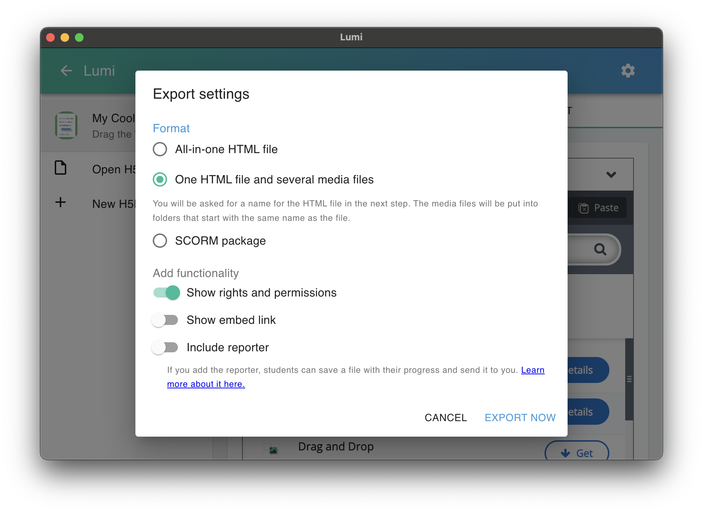

# H5P Integration

The site is customized to integrate with H5P interactive content.


<H5P
  contentId="H5Pexample"
  title="Example H5P"
/>


I will explain how to integrate H5P content using two methods:

1. Using Locally stored HTML and media files with the `H5P` component
2. Embedded content from h5p.com using the `H5PLink` component


## H5P HTML Component

The `H5P` component is used for rendering locally stored H5P content that has been exported from Lumi Desktop.

<details>
<summary>**What is Lumi Desktop?**</summary>

Lumi Desktop is a free and open-source H5P desktop application. It allows you to:
- Create and edit H5P content offline
- Supports most H5P content types
- Export H5P content as standalone HTML that can be used without H5P server
- Import existing H5P files
- Preview content without a web server

You can download Lumi Desktop from the official website:
**https://lumi.education/en/**
</details>

We are not tied to Lumi desktop, we could theoretically use any H5P editor that allows us to export HTML and any related media files.


:::warning
H5P updated there core software. [**Lumi has not yet updated there interactive video, and course presentations components**](https://help.lumi.education/en/articles/9506738-interactive-videos-and-course-presentations-not-found). These components will be important for authoring the course content. I will figure out our options for work arounds.  
:::

### Prerequisites

- [Lumi Desktop installed](https://lumi.education/en/)
- H5P content exported as HTML
- Content stored in the `H5P-Content` folder

### Exporting from Lumi

1. Build your component using Lumi and then select **File>Export**

2. From the Export settings window select `One HTML file and several media files`



<details>
<summary>**Detailed settings & export options**</summary>

**All-in-One HTML Files**
- Works well for local development
- Limited functionality when separated from media files
- **Not recommended** especially for content with external media dependencies

**Embed Links**
- Turn on if you want components embeded for use on other sites
- The `H5PEmbed` component (more below) displays content using these embed links
- The H5P content must exist somewhere online (on a server) to be linked to different platforms as an embed

**Reporting & User Data**
- Progress reporting is not supported in our current setup
- User data tracking would require:
  - Backend database integration
  - Server-side logic for data management
  - Potentially a user authentication system
- These features are out of scope for this project

**Display Options**
- Default display settings are recommended but more options can be found at the bottom of the export settings window.
- The custom display options there are available however I have not yet experimented with them

</details>

### Component Usage

The `H5P` component can only be used in files ending in `mdx` this is essentially the same as a markdown `.md` file just with a little more flavour.

- To render H5P content using this component you would use the following syntax:

  ```mdx
  <H5P 
    contentId="multiplechoice"
    title="Multiple Choice Quiz"
  />
  ```

- This renders on the page as follows:

  <H5P 
    contentId="multiplechoice"
    title="Multiple Choice Quiz"
  />

This component has been tested with several of the interactive elements found on Lumi, including those handling multiple media files:

<H5P
  contentId="hotspot"
  title="Multi Media Test"
/>

### Props

The component above is a more generally called a React component, because it uses a JavaScript library called [React](https://react.dev/).

In React we can pass customizable properties into components, here I made two simple props that we can pass into the component: 

- `contentId`: This should match the folder name in `H5P-Content` directory
- `title`: This is the title for the H5P content (used for accessibility)

<details>
<summary>**Dev Info: Where does the reusable component live?**</summary>

The H5P component is a our own solution designed for maximum reusability and customization. You can find it at:

```bash
/website/src/components/H5P/
├── index.tsx        # Core component logic
└── styles.module.css  # Styling customizations
```

**Customization Options:**
* The component can be extended with additional props in `index.tsx`
* Styling can be modified through `styles.module.css`
* Potential customization includes:
  * Container dimensions
  * Padding and margins
  * Hover effects
  * Responsive behavior
  * Loading states
  * Error handling

If you need to add new features or modify existing behavior, all changes should be made within these files to maintain consistency across implementations.
</details>

## H5P Embed Component

The `H5PLink` component is used for embedding H5P content hosted online somewhere.

### Prerequisites
- Published H5P content with embed URL
- Content must be hosted on an H5P server (e.g., h5p.com, testing-oicr.h5p.com)

### Component Usage

The `H5PLink` component can be used in any MDX file using the following syntax:

```mdx
<H5PLink
  src="https://testing-oicr.h5p.com/content/1292411552878674258/embed"
  title="Interactive Content"
/>
```

### Props

The component accepts the following properties:
- `src`: The embed URL from your H5P hosting platform
- `height`: Height of the iframe (default: "500px")
- `title`: Title for the embedded content (used for accessibility)

### Examples

Here are some examples of embedded H5P content:

<H5PLink
  src="https://testing-oicr.h5p.com/content/1292411552878674258/embed"
  height="500px"
  title="Interactive Content"
/>

<H5PLink
  src="https://testing-oicr.h5p.com/content/1292413201128160028/embed"
  height="500px"
  title="Interactive Content"
/>

<details>
<summary>**Tips for Embedded Content**</summary>

**Best Practices**
- Ensure stable hosting of H5P content
- Test embed links before implementation
- Consider loading time for embedded content

**Common Issues**
- Content not loading
  - Verify the embed URL is correct
  - Check if the H5P hosting platform is accessible in the browser using the URL
  - Ensure proper permissions are set
- Display problems
  - Adjust the height prop if content appears cut off

**Security Notes**
- Be aware that embedded content may be subject to the host's uptime and availability
- Consider backup options for critical content

</details>
